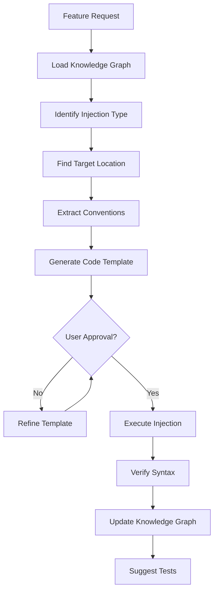

# Feature Injection Rules

## Core Principle

**Inject features that blend seamlessly with existing code while maintaining architectural integrity.**

---

## Pre-Injection Checklist

Before injecting any feature, verify:

| Check | Serena Tool | Required |
|-------|-------------|----------|
| Project knowledge loaded | `read_memory` | Yes |
| Target location identified | `find_symbol` | Yes |
| Conventions extracted | Knowledge graph | Yes |
| Impact scope analyzed | `find_referencing_symbols` | Yes |
| SOLID compliance verified | SOLID rules | Yes |

---

## Injection Types

### Type 1: New Symbol (Class/Function/Method)

**When to use**: Adding new functionality that doesn't modify existing code

**Process**:
1. Identify appropriate module based on pattern matching
2. Check naming conventions from knowledge graph
3. Verify no naming conflicts with `find_symbol`
4. Use `insert_after_symbol` or `insert_before_symbol`

**Template**:
```yaml
Injection:
  type: new_symbol
  target_file: string
  anchor_symbol: string  # Insert after/before this
  position: "after" | "before"
  content: string
  imports_needed: string[]
```

### Type 2: Extension (Add Method to Existing Class)

**When to use**: Enhancing existing class capabilities

**Process**:
1. Find class with `find_symbol`
2. Analyze existing methods for style consistency
3. Check for method name conflicts
4. Use `insert_after_symbol` targeting last method

**Template**:
```yaml
Injection:
  type: extension
  target_class: string
  method_name: string
  method_body: string
  visibility: "public" | "private" | "protected"
```

### Type 3: Implementation (New Interface Implementation)

**When to use**: Adding new implementation of existing interface

**Process**:
1. Find interface with `find_symbol`
2. List existing implementations for pattern reference
3. Create new class following implementation pattern
4. Register in appropriate factory/container if exists

**Template**:
```yaml
Injection:
  type: implementation
  interface: string
  class_name: string
  file_path: string
  method_implementations:
    - name: string
      body: string
```

### Type 4: Modification (Change Existing Code)

**When to use**: Enhancing or fixing existing functionality

**Process**:
1. Get current symbol body with `find_symbol`
2. Analyze all references with `find_referencing_symbols`
3. Plan backward-compatible change if possible
4. Use `replace_symbol_body`

**Template**:
```yaml
Injection:
  type: modification
  target_symbol: string
  new_body: string
  breaking_change: boolean
  affected_dependents: string[]
```

---

## Convention Matching Rules

### Naming Conventions

Automatically detect and apply:

| Element | Common Patterns |
|---------|-----------------|
| Class | PascalCase, suffix based (Service, Controller, Repository) |
| Method | camelCase, verb prefix (get, set, is, has, handle) |
| Variable | camelCase or snake_case (detect from existing) |
| Constant | UPPER_SNAKE_CASE |
| Interface | I-prefix or -able/-er suffix |

### Structure Conventions

1. **Import Ordering**
   - External libraries first
   - Internal modules second
   - Local imports last

2. **Method Ordering**
   - Constructor first
   - Public methods
   - Private methods
   - Static methods last

3. **File Organization**
   - Match existing module/directory structure
   - Follow grouping patterns (by feature vs by type)

---

## SOLID Compliance for Injection

### SRP: Single Responsibility

- New symbol should have ONE clear purpose
- If feature needs multiple responsibilities, create multiple symbols

### OCP: Open-Closed

- Prefer adding new implementations over modifying existing
- Use extension points (interfaces, abstract classes)

### LSP: Liskov Substitution

- New implementations must honor interface contracts
- No empty method implementations

### ISP: Interface Segregation

- Don't bloat existing interfaces
- Create new focused interfaces if needed

### DIP: Dependency Inversion

- Inject dependencies, don't create them
- Depend on abstractions

---

## Injection Workflow



---

## Code Generation Templates

### Service Pattern

```typescript
// Following project conventions for services
export class {Name}Service {
  constructor(
    private {dependency}: {DependencyType}
  ) {}

  async {action}({params}): Promise<{ReturnType}> {
    // Implementation
  }
}
```

### Repository Pattern

```typescript
// Following project conventions for repositories
export interface {Name}Repository {
  findById(id: {IdType}): Promise<{Entity} | null>;
  save(entity: {Entity}): Promise<void>;
  delete(id: {IdType}): Promise<void>;
}

export class {Name}RepositoryImpl implements {Name}Repository {
  constructor(private db: DatabaseConnection) {}

  // Implementations...
}
```

### Controller/Handler Pattern

```typescript
// Following project conventions for handlers
export class {Name}Handler {
  constructor(private {service}: {ServiceType}) {}

  async handle{Action}(request: {RequestType}): Promise<{ResponseType}> {
    // Validation
    // Business logic delegation
    // Response mapping
  }
}
```

---

## Post-Injection Verification

After each injection:

1. **Syntax Check**: Run linter/type checker
2. **Import Resolution**: Verify all imports are valid
3. **Reference Check**: Ensure no broken references
4. **SOLID Check**: Validate against SOLID rules
5. **Test Suggestion**: Propose test cases for new code

---

## Error Recovery

| Error | Recovery Action |
|-------|-----------------|
| Syntax error after injection | Rollback using Serena's replace |
| Import conflict | Add alias or choose different name |
| Name collision | Rename with convention-matching alternative |
| Type mismatch | Analyze dependencies and fix types |

---

## Integration with Knowledge Graph

After successful injection:

1. **Update Symbol Registry**
   - Add new symbol to knowledge graph
   - Update dependency edges

2. **Update Pattern Registry**
   - Register if following known pattern
   - Note any new patterns introduced

3. **Update Convention Registry**
   - Validate conventions were followed
   - Note any deviations for review
